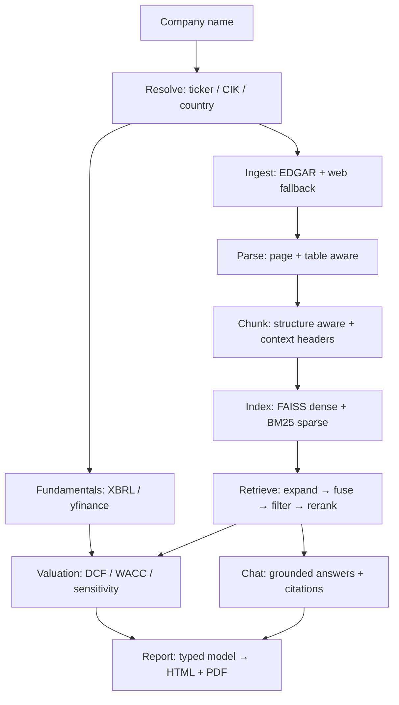

# Financial Copilot

**An equity-research assistant that reads a company's own filings, answers questions with verifiable citations, and produces a one-click DCF valuation and research report.**

Type a company name. The system finds its SEC filings, indexes them with an advanced retrieval pipeline, pulls its audited financials, builds a discounted-cash-flow valuation where *every assumption is stated and justified*, and generates a polished research report — every figure traceable to the page of the filing it came from.

🔗 **Live demo: [fincopilot.duckdns.org](https://fincopilot.duckdns.org/)**
🛠️ Built with Streamlit · OpenAI · FAISS · SEC EDGAR · deployed on AWS EC2 (nginx/Caddy + systemd) with a GitHub Actions CI/CD pipeline


---

## Why this is not another RAG demo

Most retrieval-augmented-generation projects stop at "embed the PDF, stuff top-k chunks into a prompt." This one is built around three principles that address where those demos actually fail:

1. **The language model never does arithmetic.** The entire valuation is deterministic NumPy. The model's only job is to *propose and justify* forward assumptions (revenue growth, terminal margin), and each proposal is clamped to a range the company's own history supports before it reaches the math. Numbers come from [SEC XBRL company facts](https://www.sec.gov/edgar/sec-api-documentation) — the same audited, tagged data the SEC indexes — not from a model reading figures out of prose.

2. **Numbers come from structured sources; prose comes from RAG.** Revenue, EBIT, share count, debt and cash are pulled from XBRL. RAG over the filings is used only for what it is genuinely good at: management commentary, risk factors, strategy, competitive positioning.

3. **Every claim is verifiable.** Each chunk carries `(document, page, section)` metadata from ingestion through to the answer. The chat UI shows the supporting snippet next to every claim and links to the source filing. Trust is the product.

---

## What it does

| Capability | Detail |
|---|---|
| **Company resolution** | Free-text name → ticker, exchange, SEC CIK. Scored matching (so "TCS" resolves to Tata Consultancy Services, not a similarly-named Malaysian company). |
| **Document ingestion** | SEC EDGAR as primary source (10-K, 10-Q, earnings 8-K), investor-relations sites as fallback and for non-US issuers. Content-hash de-duplication, relevance validation with logged rejection reasons. |
| **Advanced retrieval** | Structure- and table-aware chunking, hybrid dense + sparse search fused with Reciprocal Rank Fusion, LLM cross-encoder reranking, metadata filtering. |
| **Grounded chat** | Answers cite `[n]` inline; each citation resolves to a document, section and page you can open. Refuses cleanly when the filings don't contain the answer. |
| **Valuation engine** | Deterministic DCF with CAPM WACC, geometric growth decay, a full assumption ledger, a WACC × terminal-growth sensitivity grid, peer comps, and a reverse DCF ("what growth does today's price imply?"). |
| **One-click report** | An 8-9 page research document (HTML + PDF), each section generated from its own targeted retrieval, with a source appendix. |

---

## Architecture



The codebase is organised as one stage per package under `fincopilot/` — `resolve`, `ingest`, `parse`, `chunk`, `index`, `retrieve`, `chat`, `fundamentals`, `valuation`, `report`, `eval`. `app.py` is a thin Streamlit layer; all logic lives in the package, which is why the same pipeline drives the tests and the evaluation harness with no browser. See [`docs/ARCHITECTURE.md`](docs/ARCHITECTURE.md) for the full walkthrough.

---

## The retrieval stack, and what each stage buys

Each stage exists to fix a specific failure of the one before it:

| Stage | Technique | Failure it addresses |
|---|---|---|
| Chunking | Structure-aware, table-preserving | Fixed-size splitting cuts income statements in half, destroying row/column meaning |
| Chunk context | Deterministic `company / doc / FY / section` header prepended before embedding | A bare "increased 12%" chunk is unretrievable — nothing says *what* increased, or *when* |
| Query rewriting | Multi-query expansion + finance-term normalisation | User asks "how profitable"; the filing says "gross margin" |
| Sparse search | BM25 | Dense embeddings are weak on exact tokens: tickers, "Item 1A", "$60,922" |
| Dense search | `text-embedding-3-small` + FAISS | BM25 misses paraphrase and concept-level matches |
| Fusion | Reciprocal Rank Fusion | Dense and sparse scores are not comparable; RRF combines by rank, needing no calibration |
| Reranking | LLM cross-encoder scoring | Bi-encoder retrieval scores similarity, not answer-relevance |

### Ablation (measured, not asserted)

Ten hand-verified questions about NVIDIA's filings, each answerable by a specific figure that can be checked for automatically (`215,938`, `71.1%`, the `22% / 14%` customer concentration). Reproduce with `python -m fincopilot.eval.run NVIDIA`.

| Retrieval configuration | Hit rate @8 | MRR | s/query |
|---|---|---|---|
| dense only (a typical baseline) | 100% | 0.625 | 1.32 |
| + sparse (hybrid RRF) | 100% | 0.688 | 0.31 |
| + query expansion | 100% | 0.695 | 3.40 |
| + metadata filters | 100% | 0.853 | 3.01 |
| **+ reranking (full stack)** | **100%** | **1.000** | 7.40 |

**Honest reading:** hit-rate saturates at k=8 — even naive retrieval finds the answer *somewhere* in 8 passages on this corpus — so the gain is in **ranking**, not recall: reranking lifts MRR from 0.625 to a perfect 1.000, putting the answer-bearing passage first on all ten questions. (At a tighter k=3 the differences in recall become visible too.) This is a small, single-company sanity harness, not a benchmark — but it is a real, reproducible measurement rather than a claim.

---

## Valuation methodology


- **Deterministic DCF.** `run_dcf()` is a pure function — no network, no model, no state. Given inputs, it always produces the same valuation, and it is covered by 28 unit tests that assert against values computed by hand, not captured from a previous run.
- **Assumption ledger.** Every input records its value, source (`historical` / `market` / `model` / `default`), derivation, rationale, and whether it was clamped. The report prints all of it — a reader who disagrees with the output can see exactly which input to argue with.
- **Bounded model input.** The LLM proposes three forward assumptions; each is clamped to a range derived from reported history before entering the math. Asked to value a company growing 65%, an unbounded model projects 65% forever and prints a fair value several times the market cap. Bounding is what makes the result defensible.
- **Reverse DCF.** For large, richly-valued companies a forward DCF often lands well below the market price. Rather than assert the market is wrong, the model is inverted: *"holding everything else fixed, today's price implies X% revenue growth for ten years."* That is a testable statement about market expectations, not a bet against them.

---

## Tech stack

**Python** · **Streamlit** (UI) · **OpenAI** (`gpt-4.1-mini`, `text-embedding-3-small`) · **FAISS** (dense vectors) · **rank-bm25** (sparse) · **PyMuPDF** + **BeautifulSoup** (parsing) · **SEC EDGAR** submissions & XBRL APIs · **yfinance** (market data) · **NumPy/pandas** (valuation) · **Jinja2** + **ReportLab** (report rendering) · **matplotlib** (charts) · **pytest** (tests) · **AWS EC2** + **nginx** + **systemd** + **GitHub Actions** (deployment).

Deliberately **no** `torch` / `sentence-transformers`: embeddings are served by the OpenAI API, which keeps the deployed image inside a 1 GB memory budget.

---

## Running locally

```bash
git clone https://github.com/<you>/financial-copilot.git
cd financial-copilot
python -m venv venv && source venv/bin/activate   # Windows: venv\Scripts\activate
pip install -r requirements.txt

cp .env.example .env        # then edit: add OPENAI_API_KEY and SEC_USER_AGENT
streamlit run app.py
```

`SEC_USER_AGENT` must contain a real contact email — the SEC rejects requests without one. Without it the app still runs, falling back to web search and skipping audited XBRL financials.

```bash
pytest tests/ -q                      # valuation unit tests (offline, no key needed)
python -m fincopilot.eval.run NVIDIA  # retrieval ablation
```

---

## Deployment (AWS EC2 + CI/CD)

The live demo runs on an AWS EC2 instance behind nginx, kept alive by systemd. Every push to `main` triggers a **GitHub Actions** pipeline that runs the test suite and, if it passes, SSHes to the instance, pulls, and restarts the service — so the live link tracks `main` automatically. Full runbook in [`deploy/`](deploy/).

```
push to main → GitHub Actions → pytest → SSH deploy → systemctl restart
```

The public demo runs with `DEMO_MODE=1`, which enables per-session and global daily rate limits so its OpenAI usage stays bounded.

---

## Limitations

Stated plainly, because a research tool that hides its limits is the problem it claims to solve:

- The evaluation set is small (n=10) and single-company. It is a sanity harness, not a benchmark.
- Non-US companies use structured market-data statements rather than audited XBRL; the report says so, per company.
- The valuation is sensitive to the discount rate (as all DCFs are). The sensitivity grid and reverse DCF exist precisely to make that sensitivity visible rather than hidden behind a single number.
- This is a demonstration project. **It is not investment advice.**
